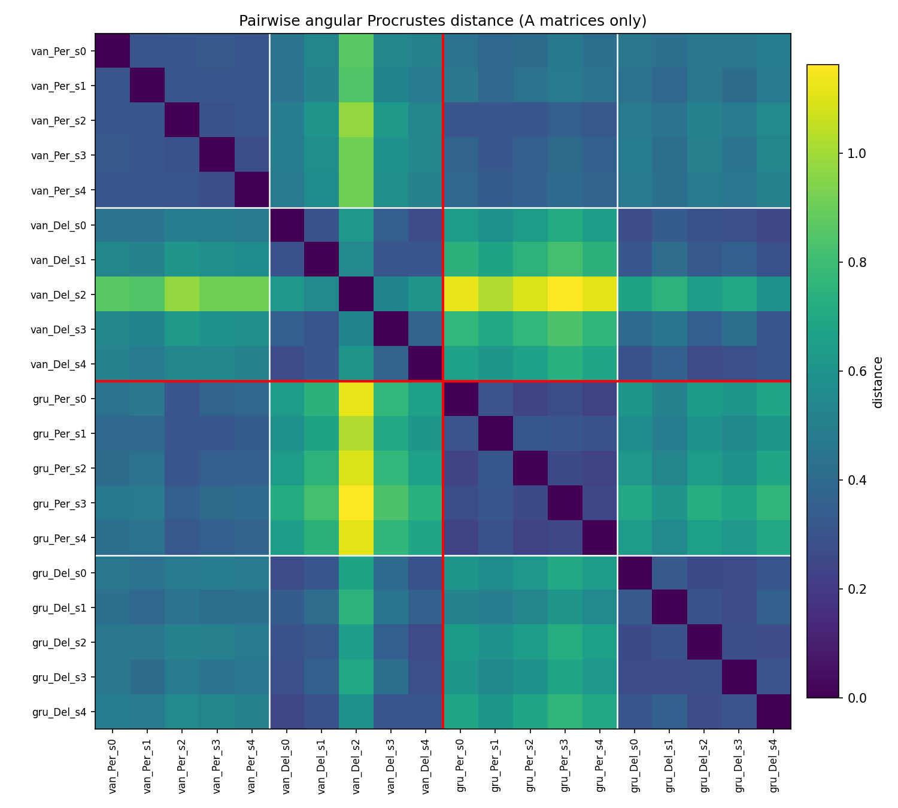
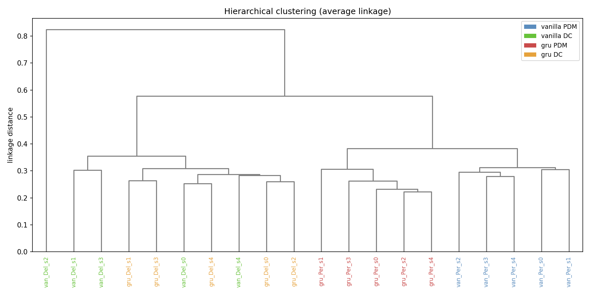
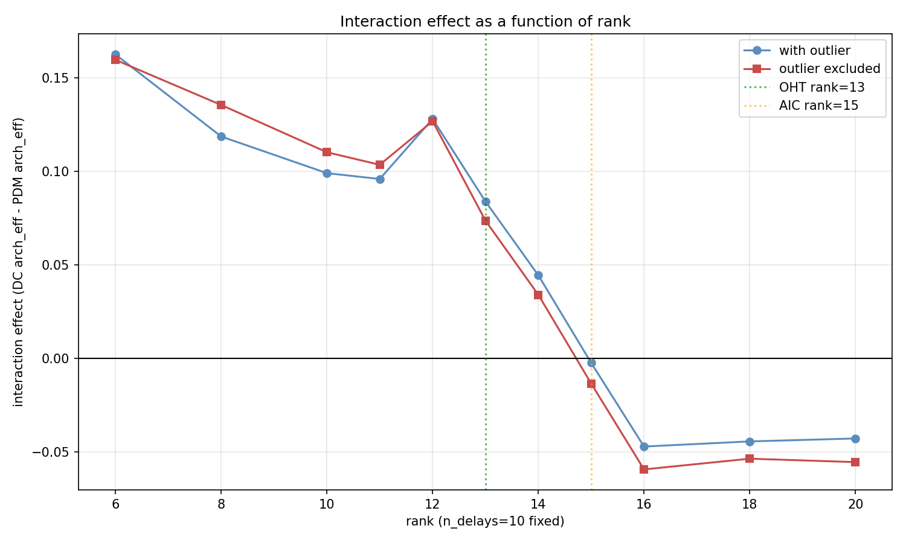
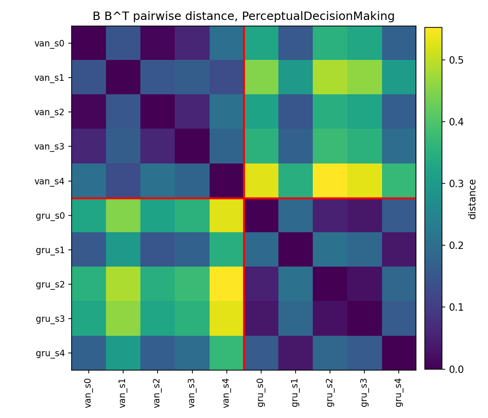
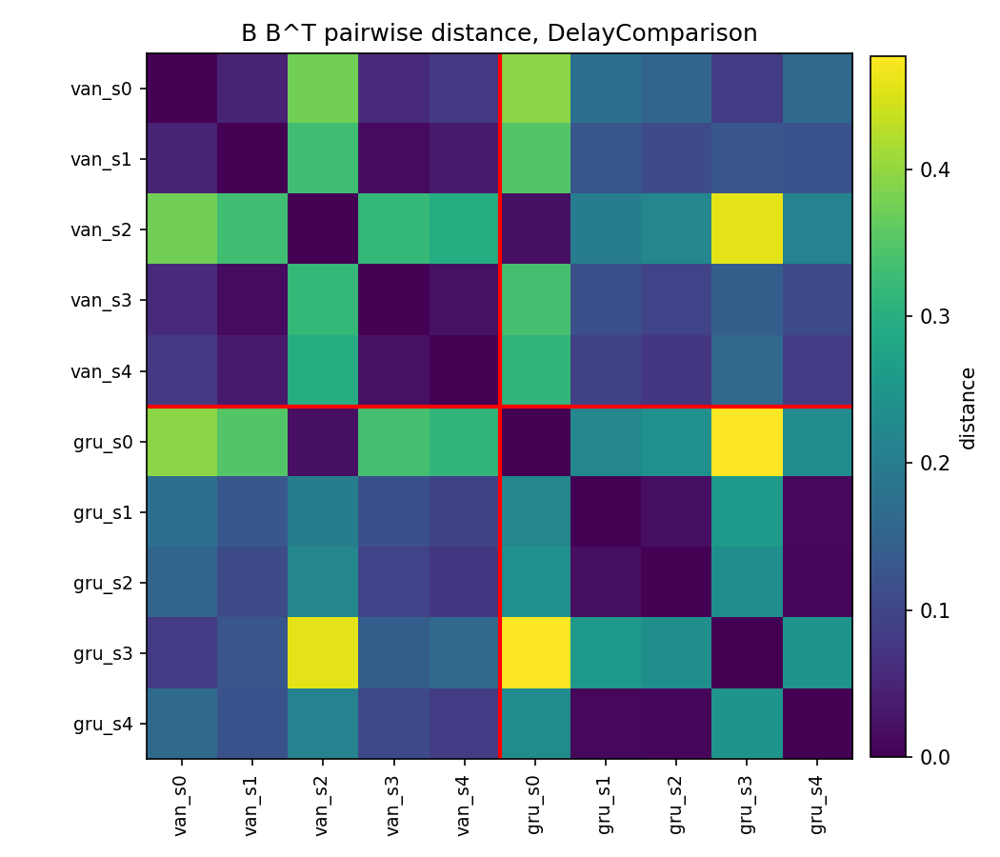
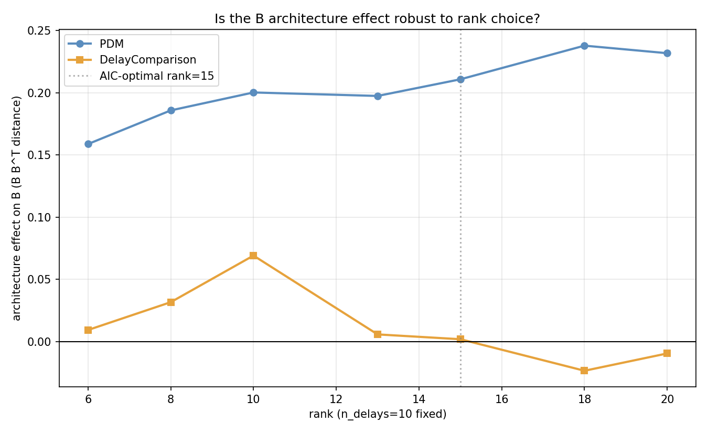
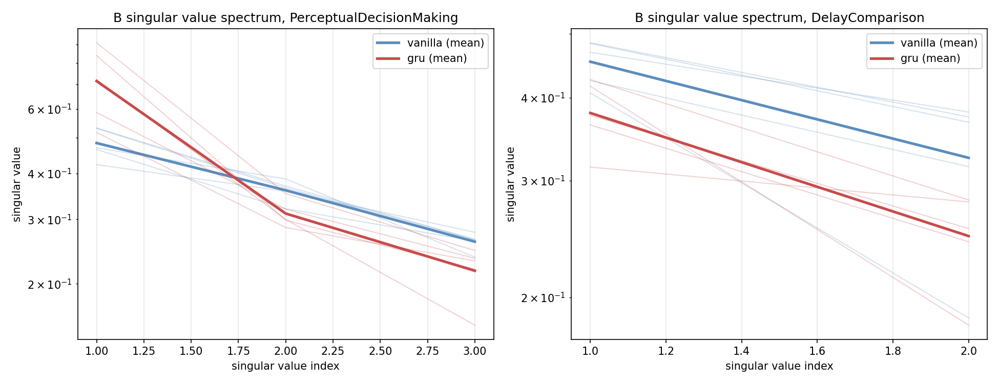
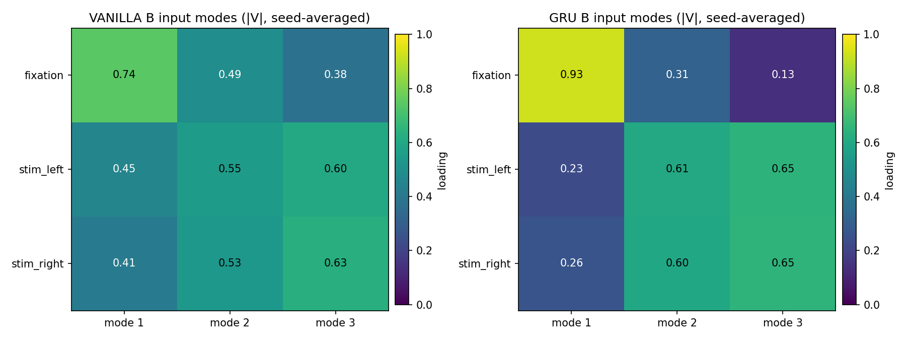
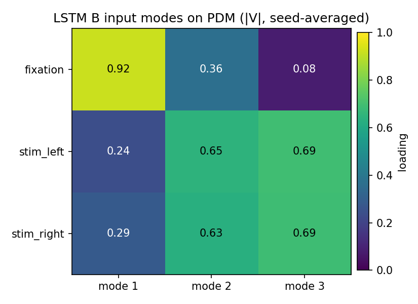

# Task and architecture in learned RNN dynamics: 
# method, results and limitations

## Background and hypothesis

**Hypothesis.** Task demands constrain the intrinsic dynamics of a recurrent network more than architecture does, but architecture still leaves a mark in how the input is read into the dynamics, and this mark is task dependent.

We arrived at this in steps. Our starting claim was only the first half: two networks with different cells but the same task should look more alike than two networks with the same cell but different tasks. Maheswaranathan et al. (2019) then showed us that this is only part of the picture: architecture strongly shapes the fine geometry of the learned dynamics, even when the coarse topology is shared. So the intrinsic dynamics is one thing, but the input processing is another, and architecture could still leave a signature there.

**Why we need InputDSA.** To test both parts at once, we need a method that can separate them. InputDSA (Huang et al. 2025) fits x_next = A x + B u to the hidden states and returns two objects we can compare:

- A, the intrinsic dynamics, where we expect the task to dominate
- B, the input matrix, where architecture can still show up

Plain DSA cannot make this split.

**Why the two tasks matter here.** Both PDM and DC are solved with a similar core motif, an approximate line or continuous attractor (Mante et al. 2013, Machens et al. 2005), so we do not expect a strong architecture by task interaction in A. But they differ clearly in input structure: PDM has three input channels (fixation and two noisy stimulus channels), DC has two (fixation and one stimulus). So architecture can leave a mark in B even when A looks similar, and we expect this mark to be larger on PDM than on DC.

**One caution.** We do not rank the tasks by number of dynamical solutions. Barak et al. (2013) show DC already admits several qualitatively different solutions, so we frame the B contrast in terms of input structure, not solution count. A structural solution diversity analysis is left as future work.

## Method

The method has three moving parts: train a matched set of small networks, fit an input driven linear model to their hidden states, and compare those fitted models with structured pairwise distances. We add a (Cell N) tag next to every number to point at the exact code in notebooks/InputDSA.ipynb.

**Models and tasks.**

- 2 architectures (vanilla RNN with tanh, GRU) times 2 tasks (PDM, DC) times 5 seeds, so 20 models
- hidden size 32, one recurrent layer and a linear readout
- small hidden size on the instructor advice, so the network is forced to use its units for the task rather than for architecture specific extras
- model in Cell 4, task datasets in Cell 5

**Training.**

- learning rate 0.003, 3000 iterations, batch size 16, cross entropy loss
- best model kept by decision accuracy on a fixed batch (deep copy), target 0.85
- goal is matched performance, not matched hyperparameters. Both architectures reached the target with the shared recipe
- Cell 6, Cell 7

**Fitting A and B.**

- fit x_next = A x + B u with SubspaceDMDc on a fixed validation batch of 64 sequences of length 100 (seed 1234). A is 32 by 32 for every model, whatever the input dimension
- InputDSA settings: delay embedding 10, fit rank studied separately (see below), no ridge (lamb 0), n4sid backend
- Cell 9, Cell 10

**Comparing the models.** We align two A matrices with an orthogonal transform and take the angular distance that remains (SimilarityTransformDist, angular score), for all 190 pairs (Cell 11). The joint mode of InputDSA fails on cross task pairs (different input dimensions), so we fit A with SubspaceDMDc first, then compare. This is equivalent to compare='state' and works for every pair.

We split the pairs into three kinds and read each effect as how far its mean sits above the noise floor, tested by a label permutation test (Cell 12, Cell 20):

- within cell (same architecture and task, different seeds): the noise floor
- across architecture within task: the architecture effect
- across task within architecture: the task effect

**Rank selection.** The fit rank turned out to be the most important hyperparameter for A, so we did not fix it by hand. We compared three principled methods:

- participation ratio of the state covariance, rank near 8 (Cell 23)
- Optimal Hard Threshold from Gavish and Donoho (2014), rank 13, very consistent across all 20 models (Cell 32)
- MASE and AIC sweep from the InputDSA paper, rank 15, with a clear AIC minimum (Cell 36)

**B analysis.** For B we use measures that need no alignment step:

- singular value spectrum and effective input dimension (participation ratio of the singular values) (Cell 43)
- B B^T distance within each task, where B B^T captures the directions into which input is injected (Cell 44)
- SVD of B for the input loadings, which show how channels are grouped into input modes (Cell 49)

## Main results

### The networks learn the tasks

All 20 networks pass the 0.85 decision accuracy target (Cell 7). Mean decision accuracy: vanilla PDM 0.895, GRU PDM 0.883, vanilla DC 0.986, GRU DC 0.992. DC is nearly solved by both architectures. PDM sits a little lower, near 0.88 to 0.90, which looks like a task ceiling and not a training problem. The architectures are matched within each task, so the architecture effect stays clean.

The fitted A matrices all have their top eigenvalue near the unit circle, about 0.97 to 1.02, the slow near line attractor regime these tasks need (Cell 10, Mante et al. 2013, Machens et al. 2005).

### A matrix result: task dominates architecture

The first half of the hypothesis holds. Task constrains the intrinsic dynamics more than architecture does, and clearly so.

Getting here was not immediate. The first pass gave a task effect that looked reasonable but an architecture by task interaction that was hard to read and moved when we changed small things. So we stopped and worked on the rank of the fit before trusting anything else. Only after the rank study did we feel confident that the task dominance claim is stable, because it holds across every rank we tested.

The distance matrix clusters first by task and only weakly, inside PDM, by architecture (Cell 13). At rank 20 (Cell 12, Cell 20):

| Effect | Size above noise floor | Permutation test |
| --- | --- | --- |
| Task | 0.290 | p < 0.001, about 8 sigma |
| Architecture | 0.066 | p < 0.001, about 5.5 sigma |

The exact task to architecture ratio is not fixed. It is about 4.4 at the original settings, 2.7 without fixation (Cell 17) and 1.65 with the other backend (Cell 27). So we report the direction, not the ratio.

### The A matrix interaction is not robust

The sharper claim, that architecture matters more on one task than on the other, does not survive. Its sign depends on the rank (Cell 12, Cell 24, Cell 34, Cell 38, Cell 39):

| Rank (method) | DC minus PDM architecture effect | Direction |
| --- | --- | --- |
| 20 (original) | -0.053 | against |
| 15 (AIC optimal) | about 0 | none |
| 13 (Optimal Hard Threshold) | +0.089 | for |
| 8 (participation ratio) | +0.131 | for |

The two most principled ranks, OHT (13) and AIC (15), disagree. So we call the A interaction inconclusive. This matches the background point that the two tasks are dynamically too similar for a strong A interaction.

### B matrix result: architecture leaves a task dependent mark

The second half of the hypothesis holds too, and this is the main positive result of the project. The architecture effect on B is large on PDM and near zero on DC (Cell 44):

| Task | Within arch | Across arch | Architecture effect | Permutation p |
| --- | --- | --- | --- | --- |
| PDM | 0.126 | 0.337 | +0.211 | < 0.001 |
| DC | 0.176 | 0.178 | +0.002 | 0.49 |

Unlike the A interaction, this does not flip with rank (Cell 45). So architecture is not invisible after all. It marks how input is read, on PDM but not on DC.

The effective input dimension tells the same story with one number (Cell 43). On PDM vanilla uses 2.82 of its 3 channels, GRU uses 2.37 (difference 0.45, p = 0.009). On DC both use about 1.9 of their 2 channels (difference 0.03, p = 0.50).

### What the architecture effect on B means

The effect is about how the network coordinates several input channels, not how it reads any single one. Two findings drive this:

- The effect needs several channels at once. Removing fixation, or keeping only fixation, both kill it (Cell 48).
- The SVD of B shows the concrete difference. The GRU concentrates fixation into one input mode (loading about 0.93), while vanilla spreads it across modes (about 0.74, 0.49, 0.38). This is significant on PDM, p = 0.017 (Cell 49, Cell 50). It fits what the gates of the GRU are built to do.

For DC the same segregation exists in the GRU, but the mode holding fixation flips across seeds. B B^T ignores mode order, so this is invisible to the distance measure even though the loading heatmaps show it (Cell 50). So the DC null is partly about the measure and not only about the networks.

One piece is still open. The angles between the raw channel injection directions run opposite to the loading prediction and are not significant (Cell 51). The loadings give a clear result but the full mechanism is not closed.

### A stress test with a third architecture: LSTM

The B result generalises to a second gated architecture. We added LSTM as a third architecture with the same setup (10 more models, matched seeds, hidden size and training recipe). On all three metrics we already used, LSTM behaves like GRU rather than like vanilla RNN.

| Metric (on PDM) | vanilla | GRU | LSTM |
| --- | --- | --- | --- |
| B B^T distance to vanilla | (self) | +0.211, p < 0.001 | +0.306, p < 0.001 |
| B B^T distance to GRU | +0.211 | (self) | +0.008, p = 0.36 (ns) |
| Effective input dim (max 3) | 2.82 | 2.37 | 2.12 |
| Fixation loading in mode 1 | 0.74 ± 0.12 | 0.93 ± 0.05 | 0.92 ± 0.03 |

On DC all three architectures stay indistinguishable, same as before (all p > 0.4).

Two gated architectures cluster together on PDM, both separated from vanilla, and DC stays flat for all three. So the strongest form of the result is a "gated vs non-gated" typology: both gated architectures segregate timing from content, the vanilla RNN blends them.

## Conclusion

**Task and architecture shape different parts of the model.** Task dominates the intrinsic dynamics A. Architecture leaves a task dependent mark in the input matrix B, large on PDM and near zero on DC. This two level answer is more informative than either half alone.

**InputDSA is what makes this possible.** Plain DSA would have shown only the A part and looked like a simple "task wins" story. Separating out B is what lets us also see the architectural signature in how input is read into the dynamics.

**The B mechanism groups architectures into two families.** Gated architectures (GRU, LSTM) segregate timing into a dedicated input mode. Vanilla RNN blends timing and content. This "gated vs non-gated" split is clean on PDM and absent on DC. On DC the same segregation exists inside gated networks, but the mode holding fixation flips across seeds, so B B^T cannot see it. In other words, the DC null is partly about the measure, not only about the networks.

**What stays open.** The sharper A interaction claim did not survive rank sensitivity, so we call it inconclusive. Two items for future work: an independent test of solution diversity between the two tasks, and a qualitatively different task such as the flip flop task of Sussillo and Barak (2013), where the shared attractor motif of PDM and DC is broken.

## Limitations

- **PDM sits below DC in accuracy.** The raw task effect is slightly confounded with training quality. Architectures are matched within each task, so the architecture effect is clean (Cell 7).
- **The A analysis depends on the rank.** Task dominance holds across ranks, but the interaction sign flips and OHT (13) and AIC (15) disagree, so the A interaction is inconclusive (Cells 31 to 39). MASE also stayed above 1 (Cell 36).
- **No independent constraint ranking.** Barak et al. (2013) show DC admits several solutions, so we do not rank the tasks by solution count. A structural analysis is future work.
- **B magnitude is not fixed.** Across validation batches the PDM effect moves from 0.21 to 0.14 (still significant), the DC effect from 0.002 to 0.038 (p 0.49 to 0.09). The pattern holds, the numbers shift (Cell 47).
- **B B^T can hide an effect.** It ignores mode order, so gated segregation on DC (flipping modes across seeds) is invisible to it even though the loading heatmaps show it (Cell 49, Cell 50).
- **The mechanism is only partly closed.** Loadings give a significant difference but injection angles run the other way and are not significant (Cell 51).
- **Only two tasks, and they are dynamically similar.** Both lean on a slow attractor motif. A flip flop task (Sussillo and Barak 2013) would give architecture more room to differ.
- **The LSTM check is deliberately narrow.** Three metrics on 10 models, matched to the main analysis. A broader sweep over network types and sizes was out of scope.
- **Small sample and fixed size.** 20 models plus 10 for LSTM, one unusual vanilla DC seed (Cell 15, Cell 16), hidden size fixed at 32.

## References

Barak, O., Sussillo, D., Romo, R., Tsodyks, M. and Abbott, L. F. (2013). From fixed points to chaos: three models of delayed discrimination. Progress in Neurobiology, 103, 214-222.

Driscoll, L. N., Shenoy, K. V. and Sussillo, D. (2024). Flexible multitask computation in recurrent networks utilizes shared dynamical motifs. Nature Neuroscience. [Please check the exact volume and page numbers.]

Gavish, M. and Donoho, D. L. (2014). The optimal hard threshold for singular values is 4 over root 3. IEEE Transactions on Information Theory, 60(8), 5040-5053.

Huang et al. (2025). InputDSA. [Please fill in the exact author list, title and venue of the InputDSA paper you are using.]

Machens, C. K., Romo, R. and Brody, C. D. (2005). Flexible control of mutual inhibition: a neural model of two-interval discrimination. Science, 307(5712), 1121-1124.

Maheswaranathan, N., Williams, A. H., Golub, M. D., Ganguli, S. and Sussillo, D. (2019). Universality and individuality in neural dynamics across large populations of recurrent networks. Advances in Neural Information Processing Systems, 32.

Mante, V., Sussillo, D., Shenoy, K. V. and Newsome, W. T. (2013). Context-dependent computation by recurrent dynamics in prefrontal cortex. Nature, 503(7474), 78-84.

Ostrow et al. (2023). Dynamical Similarity Analysis. [Please fill in the exact author list, title and venue of the DSA paper you are using.]

Sussillo, D. and Barak, O. (2013). Opening the black box: low-dimensional dynamics in high-dimensional recurrent neural networks. Neural Computation, 25(3), 626-649.
